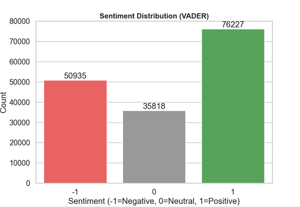
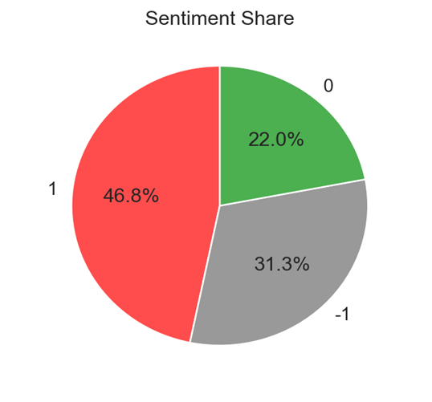
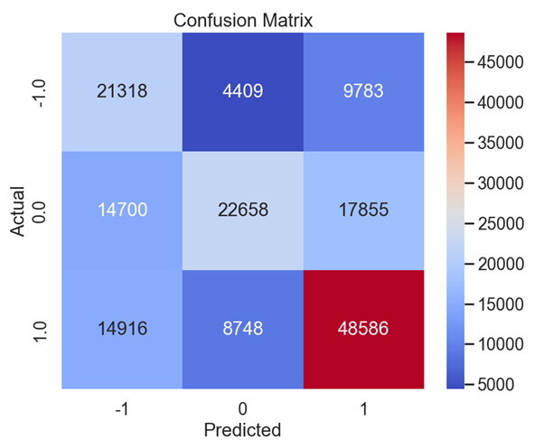

# 📊 Sentiment Analysis on X Data using VADER

## 📌 Overview
This project performs sentiment analysis on X (Twitter) data using the VADER Sentiment Analyzer. The goal is to classify posts into positive, negative, and neutral sentiments and analyze overall public opinion.

---

## 📊 Dataset
The dataset contains:
- **clean_text** → Preprocessed tweet text  
- **category** → Sentiment label  
  - 1 → Positive  
  - 0 → Neutral  
  - -1 → Negative  

---

## ⚙️ Methodology
- Applied VADER sentiment analysis using NLTK  
- Converted sentiment scores into labels using thresholds  
- Compared predicted sentiments with actual labels  
- Visualized results using graphs  

---

## 📈 Results

### Actual Data
- Positive: 72,250 (44.3%)  
- Neutral: 55,213 (33.9%)  
- Negative: 35,510 (21.8%)  

### Predicted Data (VADER)
- Positive: 76,227 (46.8%)  
- Neutral: 50,935 (31.2%)  
- Negative: 35,818 (22.0%)  

---

## 📊 Visualizations

### Bar Chart

### Pie Chart

### Confusion Matrix

---

## 🔍 Insights
The results show that positive sentiment is dominant in the dataset. The VADER model performs well in identifying positive sentiments, with minor misclassification in neutral and negative categories.

---

## 🛠 Tools Used
- Python  
- Pandas  
- Seaborn  
- Matplotlib  
- NLTK (VADER)  

---

## 📄 Report
The complete detailed report is available here:  
👉 **report.pdf**
